# Snake Game on FPGA using MAX7219 LED Matrix

## Project Overview and Introduction

This project implements a classic Snake game on an FPGA using a MAX7219-controlled 8x8 LED matrix. The game features real-time movement control via UART interface, pseudo-random dot generation using Linear
Feedback Shift Registers (LFSR), and collision detection. The snake is represented as a moving dot for simplicity, and the game ends when the snake hits the walls, causing the LED matrix to flash.

### Game Concept

The game implements the following features:   

Snake Representation: A moving dot that represents the snake's head
Dot Generation: Randomly placed dots that appear on the matrix
Movement Mechanics: The dot moves when "eaten" by the snake
Game Over Condition: Collision with walls triggers a flashing LED matrix effect

Input Control: UART interface with WASD controls

W → Move Up  
A → Move Left  
S → Move Down  
D → Move Right  

Output Display: MAX7219-driven 8x8 LED Matrix via SPI

### The Five Major Components

The project is built around five major components that work together to create the complete game system.
The Five Major Components as shown below and in Figure 1

Interface with LED Matrix over SPI - Communication protocol to control the MAX7219 display in real-time
Timer System - Uses timers to control LED matrix updates and snake movement
Pseudo-Random Generator - LFSR-based system to generate random dot positions
Finite State Machine (FSM) - Controls snake direction based on user input
UART Control - Receives direction commands from external terminal

  

  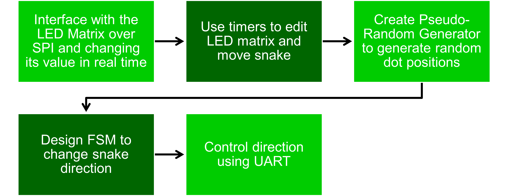
  
<em>Figure 1: The Five Major Components of the Snake Game System</em>

  

## Block Diagrams
### General Block Diagram

The block diagram in Figure 2 shows how data flows from the UART input through the direction control FSM, into RAM storage, and finally to the MAX7219 LED matrix via SPI. The timer module coordinates updates,
while the LFSR generates random positions for dots.

  

  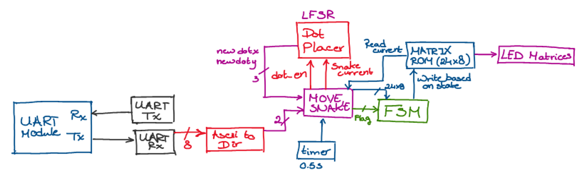
  
<em>Figure 2: General System Block Diagram Showing Data Flow</em>

  

### System State Diagram

The original system state diagram was designed to manage different game states. However, due to reduction in implemented features, this was later incorporated directly into the main module for simplified control
flow. The original general state diagram can be seen 
in Figure 3

  

  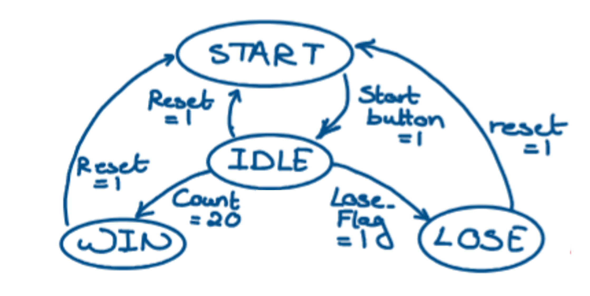
  
<em>Figure 3: General System State Diagram (Later Integrated into Main Module)</em>

  

### Direction Control FSM (Move_Snake Submodule)

The Move_Snake submodule implements a Finite State Machine to control the snake's direction based on UART input commands.

The FSM has four states corresponding to the four movement directions:

P1 → Moving Up (W key)
P2 → Moving Right (D key)
P3 → Moving Down (S key)
P4 → Moving Left (A key)

The state transitions occur when valid directional input is received, with logic to prevent the snake from reversing into itself (e.g., cannot go directly from up to down or from left to right). The state 
diagram can be seen in Figure 4.

  

  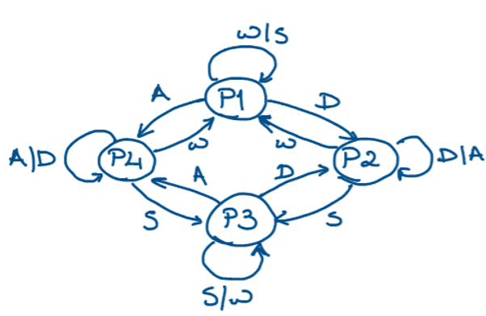
  
<em>Figure 4: Move_Snake FSM State Diagram for Direction Control</em>

  

## Interface with LED Matrix over SPI

The MAX7219 LED matrix driver IC is controlled via the SPI (Serial Peripheral Interface) protocol. This section details the hardware interface and driver implementation.

### MAX7219 Pinout Configuration

The MAX7219 IC requires specific connections for proper operation:

Din - Serial Data Input
CLK - Clock Signal
CS (Chip Select/LOAD) - Load data signal
VCC - Power Supply
GND - Ground
DOUT - Data Output (for daisy-chaining multiple displays)

The pinout diagram can be seen below in Figure 5.

  

  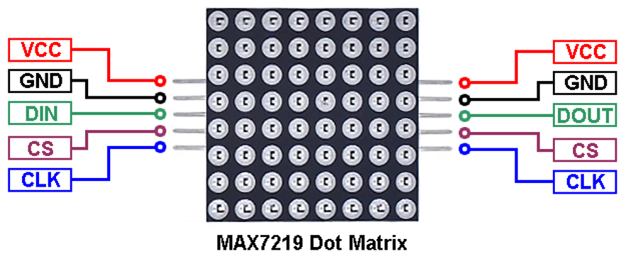
  
<em>Figure 5: MAX7219 LED Matrix Driver Pinout Diagram</em>

  

### MAX7219_Driver Submodule

The driver module handles the serial communication protocol with the MAX7219. It implements three major parts:

1: Takes 8 row inputs with 8 bits each (64 bits total representing the entire LED matrix). Data is sourced from RAM and sent over SPI.  
2: Sends 1 bit to Din in 2 clock cycles, transmitting a full row (8 bits) in 16 clock cycles. This ensures proper timing for the MAX7219 to latch data correctly.  
3: Controls max_cs (Chip Select) signal, keeping it low while sending new data to the MAX7219, then raising it to latch the data into the display registers.  

### MAX7219 and 8x8 RAM Interface

The LED matrix data is stored in an 8x8 RAM structure where each row represents one row of LEDs. The RAM is continuously read by the MAX7219 driver and transmitted to the display. This architecture allows for 
easy manipulation of the display content by simply writing to the appropriate RAM addresses without having to send data over SPI everytime the data is manipulated.
Figure 6 shows the block diagram of how the Driver and the RAM are connected.

  

  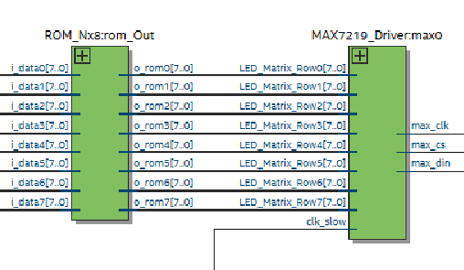
  
<em>Figure 6: MAX7219 Interface with 8x8 RAM Structure</em>

  

### Testing Challenges and Solutions

During testing, significant issues arose with data being sent incorrectly or not appearing on the display at all. Initial hypotheses included:

Clock Speed Issues - Thought the SPI clock might be too fast or too slow
Signal Level Problems - Suspected Din, CLK, and CS voltage requirements weren't met

After extensive testing and debugging (including AI-assisted analysis), the root cause was identified as clock and chip select synchronization issues. The CLK and CS signals needed precise timing relationships to properly latch data into the MAX7219.

### Successful Test Results

Once the synchronization issues were resolved, the MAX7219 successfully displayed the RAM contents that were hard coded to the memory structure, confirming the operation of the game display.
Figure 7 below shows the hard coded data being displayed onto the LED Matrix.

  

  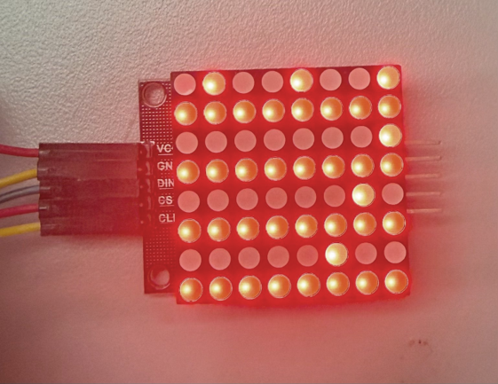
  
<em>Figure 7: Successful MAX7219 with RAM Test Results</em>

  

## Timer System for Movement Control

The game uses a timer-based system to control the refresh the data on the LED matrix and the movement speed of the snake. 

### 0.5 Second Timer Implementation

The timer is designed to generate a pulse every 0.5 seconds, which triggers the snake to move one position. The timer calculation is based on the FPGA clock frequency:
Timer Calculation:

T_counter = 50 MHz × 0.5 s = 25,000,000 clock cycles
Counter_Max = T_counter / 2 = 12,500,000

The counter increments on each clock cycle and toggles the output when it reaches Counter_Max, creating a precise 0.5-second interval.
Figure 8 shows the timer code where you can see the Counter_Max value.

  

  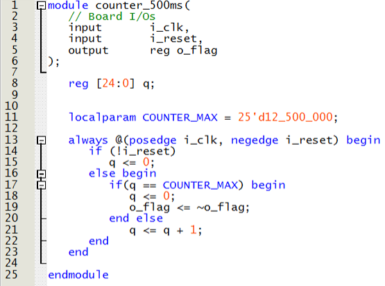
  
<em>Figure 8: 0.5 Second Timer Implementation</em>

  

### Moving Point Animation

The timer output triggers an update to the RAM, moving the snake's position by incrementing the column index every 0.5 seconds. This creates the visual effect of the snake moving across the LED matrix.

  

  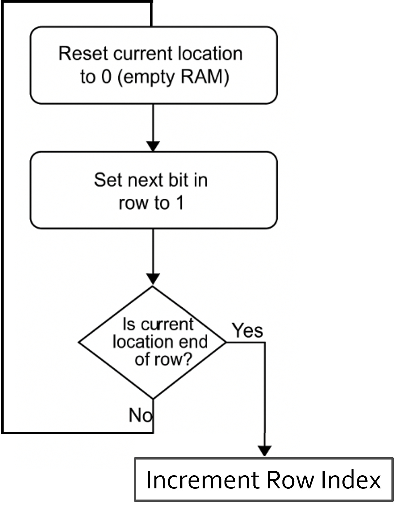
  
<em>Figure 9: Moving a Point on MAX7219 Every 0.5s - Row Index Increment Logic</em>

  

  
  
<em>Figure 10: Moving a Point on MAX7219 Every 0.5s - Complete Movement Implementation</em>

  

### Collision Detection

The game implements boundary checking to detect when the snake hits the walls. When a collision is detected, the game ends and the LED matrix flashes on and off to indicate game over.

  

  
  
<em>Figure 11: Game Ends When Point Hits the Wall - Collision Detection Logic</em>

  

## Pseudo-Random Number Generator

The game uses a Linear Feedback Shift Register (LFSR) to generate pseudo-random positions for the dots that the snake must collect.

### LFSR-Based Dot Location Generator

The system employs two separate LFSR generators:

Column Random Generator - Generates random X coordinates (0-7)
Row Random Generator - Generates random Y coordinates (0-7)

LFSRs provide a simple hardware implementation for pseudo-random number generation with minimal logic resources.

  

  
  
<em>Figure 12: Dot Location Generator Using Dual LFSR Architecture</em>

  

### LFSR Implementation Details

The LFSR uses XOR feedback taps to create a maximal-length sequence, ensuring that all possible positions are generated before the sequence repeats and that the sequence for x is defferent than that of y. This 
provides a good distribution of random dot placements across the LED matrix.
  

  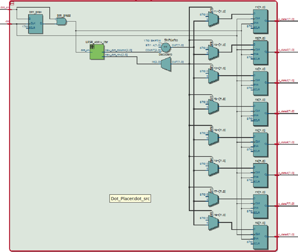
  
<em>Figure 13: Detailed LFSR Implementation for Pseudo-Random Generation</em>

  

### Dot Placement Testing

Initial testing used KEY[0] as the dot_en signal to manually trigger dot placement. This allowed verification that the LFSR generated valid positions and that the dot appeared correctly on the LED matrix.

  

  
  
<em>Figure 14: Dot Placer with KEY[0] as Enable Signal for Testing</em>

  

## Direction Control and UART Interface

The final integration combines the Move_Snake FSM with UART input to enable real-time directional control of the snake.

### Move_Snake FSM Implementation

The FSM continuously monitors for UART input and transitions between states based on the received direction commands. Each state corresponds to a movement direction and controls how the snake's position is 
updated in RAM.

State Definitions:

P1 → Moving Up (decrements row index)
P2 → Moving Right (increments column index)
P3 → Moving Down (increments row index)
P4 → Moving Left (decrements column index)

  

  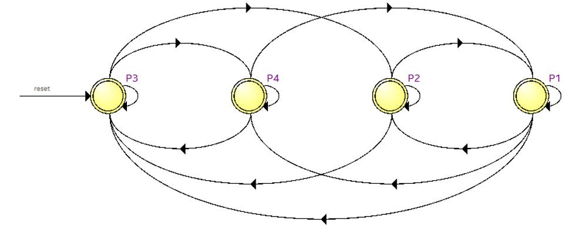
  
<em>Figure 15: Move_Snake FSM Implementation for Direction Control</em>

  

### ASCII to Direction Converter

The UART interface receives ASCII characters from a serial terminal. A converter module translates these ASCII codes into direction signals that the FSM can understand:

'W' (0x57) → Up signal
'A' (0x41) → Left signal
'S' (0x53) → Down signal
'D' (0x44) → Right signal

  

  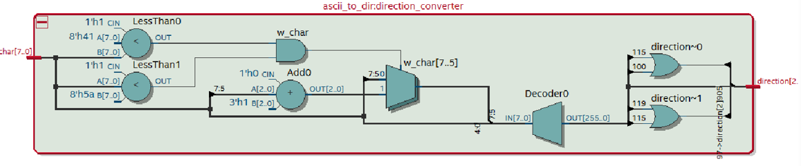
  
<em>Figure 19: ASCII to Direction Converter Module</em>

  

Unfortunately due to time consraints and struggles with RealTerm sending the input data in the incorrect type (not ASCII), the ascii input control was not checked and tested.

### Future Additions
Several features were planned but not yet implemented, providing opportunities for future development.

Planned Additional Features:

Dot Eating Mechanism - Incorporate the dot placer into the game so the snake can actually collect dots
Score Tracking - Count number of dots eaten and display the score on 7-segment displays
Snake Growth - Make the snake grow longer as it consumes more dots
Difficulty Levels - Implement multiple timers to control different snake speeds (Easy, Medium, Hard)
Restart Functionality - Add a button to restart the game without reprogramming
Expanded Play Area - Daisy-chain multiple LED matrices to create a larger 16x16 or 24x24 game grid

## Project Summary

This project successfully demonstrates the implementation of a real-time game system on an FPGA platform, combining digital design principles with practical hardware interfacing. The snake game showcases key concepts including SPI communication, finite state machines, timer-based control, pseudo-random number generation, and UART serial communication. Despite the simplifications made during development, the core game mechanics function correctly and provide a foundation for future enhancements. The project highlights both the capabilities and challenges of FPGA-based embedded system design.

Looking back at the five major components, four of the core functionality have been successfully implemented:

✓ Interface with LED Matrix over SPI - Complete with synchronization fixes
✓ Timer System - 0.5s timer controlling movement updates
✓ Pseudo-Random Generator - LFSR-based dot position generation
✓ Direction Control FSM - Four-state machine for movement

This proved that this project is not achievable using an FPGA and creates the general framework to allow for easy incorporation of additional features.
