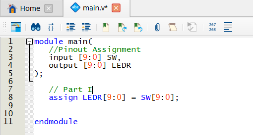
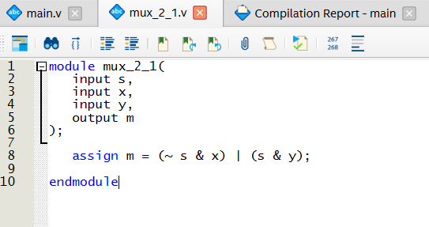
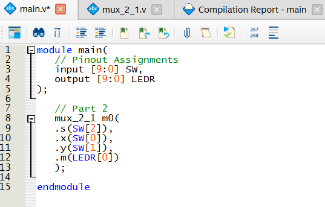
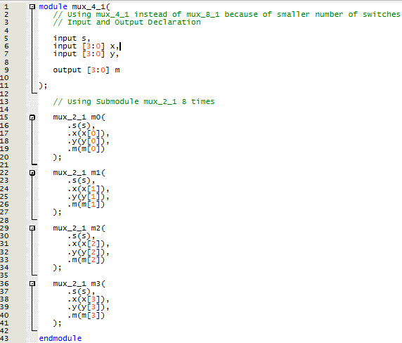
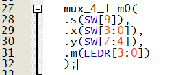
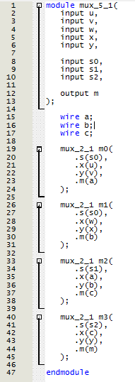
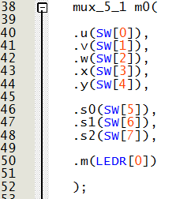
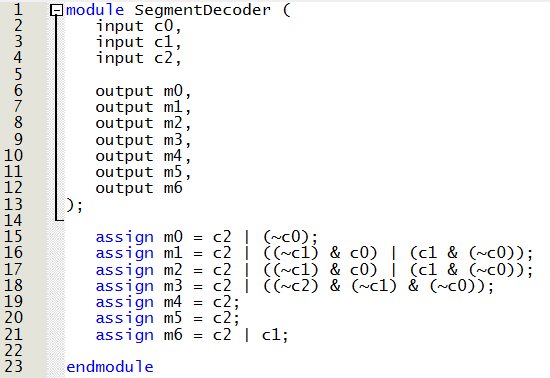
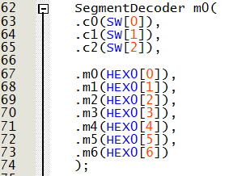

# Lab 1 Report
## Introduction
This lab is the first lab in the Advanced Digital Design Design Course, so it focusses on introducing Verilog as a Hardware Design Language as well as 
getting the student familiar with the FPGA board/Development Kit used (DE10-Lite). This overall goal is accomplished through several parts that build 
towards the final part where a 7-segment display is used to display the word "HELLO".

## Part I
This part of the lab is an introduction to the Quartus software and a test of the LEDs and switches on the board. We are essentially creating a direct 
connection between each of the 10 switches and the corresponding 10 LEDs. The lab report refers to 18 peripherals for each inputs and outputs; however,  we 
will only be using 10 switches and LEDs because out development board is a different version than the one that the lab document was initially designed for.

Quartus prime was used as the software to interface with the development board. To create the deirect connections on Verilog, 'assign' statements were 
used to model a wire connecting the LEDs to the switches output (0 or 1). The image below shows a screenshot of the code.    

<figure>
  

    
  

</figure>

  <figcaption><em>Figure 1: Verilog Code Screenshot for Part 1</em></figcaption>

  
The following is the video of the working board once the code is uploaded to it.
  

  
  https://github.com/user-attachments/assets/a1d2cb5b-0416-4b49-a3fb-7d1414048db1
  <figcaption><em>Video 1: Video of Board doing Part 1</em></figcaption>

  

## Part II
In this part of the lab, we are creating a simple 2 input, 1 select bit multiplexer. We created the mux_2_1 first on logisim to test and understand how 
it should work. Then, we created the multiplexer using HDL (in this case Verilog) in a way that switches can be used as inputs and LEDs can be used for 
the outputs. The code was finally uploaded to the DE10-Lite board to ensure that it functions correctly.

### LogiSim
The 2 input, 1 select multiplexer was made using the multiplexer symbol and the function can be seen below in video 2. 
  

  
  
  <figcaption><em>Video 2: Working 2 Input, 1 Select Multiplexer on LogiSim</em></figcaption>

 
This circuit can also be created using logic gates as shown in Video 3. 
  

  
  
  <figcaption><em>Video 3: Working MUX 2 to 1 Circuit using Logic Gates on LogiSim</em></figcaption>

### Development Board
Code was written to implement the mux_2_1 response using Verilog HDL and that was then uploaded to the development board for testing using switches as inputs
and LEDs as outputs.

The written code can be seen below in Figure 2 and this code corresponds to the submodule mux_2_1 that was created in order to be referenced in the main.
 

<figure>
  

    
  

</figure>

  <figcaption><em>Figure 3: Verilog Code Screenshot for mux_2_1 Submodule</em></figcaption>

  

The submodule was then used in the main code as can be seen in Figure 3

<figure>
  

    
  

</figure>

  <figcaption><em>Figure 4: Verilog main Code Screenshot for Part 1</em></figcaption>

  

A video of the multiplexer working on the development board can be seen below where the first and second right-most switches are x and y respectively and
the 3rd switch from the right is the select bit 's'.

  
  https://github.com/user-attachments/assets/25b85e89-378e-41cf-8ee5-12fd550a7c4e
  <figcaption><em>Video 4: Working MUX 2 to 1 on the Development Board</em></figcaption>

  

### 8-bit MUX using 8 mux_2_1
Once the mux_2_1 was confirmed to be working, it was then used to design a 16-bit input, 8-bit select and 8-bit output multiplexer.
This is simulated in Logisim as below in video 5 using an 8 input bit multiplexer that only uses one select bit.

  
  
  <figcaption><em>Video 5: Simulated MUX 8 to 1 on LogiSim</em></figcaption>

  

This part of the project was then coded to fit the board which does not have enough switches for both the inputs and select bit. As a result, the code designed
was a mux_4_1 not a mux_8_1 so that there are 8 total input switches and 1 select switch. The code written for the submodule can be seen below in Figure 5.

<figure>
  

    
  

</figure>

  <figcaption><em>Figure 5: Verilog Code Screenshot for the mux_4_1 Submodule</em></figcaption>

  

The submodule was then used in the main code with 2 groups of 4 switches for x and y and the 4 right-most LEDs indicate the output. Switch number 9 was used for
the select bit.

<figure>
  

    
  

</figure>

  <figcaption><em>Figure 6: Verilog main Code Screenshot for the mux_4_1 Implementation</em></figcaption>

  

The code was synthesized and uploaded. Once the code was uploaded, the x bits were set to 0101 and the y bits are set to 1010. The select bit was then turned on 
and off repeatedly to see the switched logic of the multiplexer. The observed response on the development board was recorded and can be seen below in Video 6.

  
  https://github.com/user-attachments/assets/1c4232a6-9440-407a-88de-0a66a8e58749
  <figcaption><em>Video 6: mux_4_1 Working Video on Development Board</em></figcaption>

  

## Part III
In this part of the lab, we are making a three bit wide 5-to-1 multiplexer which uses three instances of a mux_5_1. The mux_5_1 is simulated on LogiSim in Video 7.

  
  
  <figcaption><em>Video 7: Simulated MUX 5 to 1 on LogiSim</em></figcaption>

  

The following 5 input, 3 select and 1 output multiplexer was coded onto the development board using the mux_2_1 submodules as shown in Figure 7.

<figure>
  

    
  

</figure>

  <figcaption><em>Figure 7: Verilog Code Screenshot for the mux_5_1 Submodule</em></figcaption>

  

This was followed by the implementation of the submodule in the top module (main code) as follows.

<figure>
  

    
  

</figure>

  <figcaption><em>Figure 8: Verilog Code Screenshot for the mux_5_1</em></figcaption>

  

This main code was then synthesized and uploaded to the board, and a video of the functioning MUX was recorded. The video can be seen below.

  
  https://github.com/user-attachments/assets/bc69ff4e-25c9-4801-b810-65053d6cf978
  <figcaption><em>Video 8: mux_5_1 Working Video on Development Board</em></figcaption>

  

## Part IV 
In this part of the lab, we are creating a 7-Segment Display Decoder.
Kmaps are used to derive the equations for the different output bits corresponding to the lines on the display from the 3-bit input.
The equations were as follows:  
    m0 = c2 | ~c0
    m1 = m2 = c2 | ~(c1 & c0) | (c1 & ~c0)
    m3 = c2 | (~c2 & ~c1 & ~c0)
    m4 = m5 = c2
    m6 = c2 | c1
  
The code was written for the 7 segment display submodule as can be seen below in Figure 9.

<figure>
  

    
  

</figure>

  <figcaption><em>Figure 9: Verilog Code Screenshot for the 7 Segment Display Decoder Submodule</em></figcaption>

  

An image of the main code which uses the submodule to allow HEX0 to function using the switches as intended can be seen below in Figure 10.

<figure>
  

    
  

</figure>

  <figcaption><em>Figure 10: Verilog main Code Screenshot for the 7 Segment Display Decoder</em></figcaption>

  

A video of the 7 Segment Display on the Development Board can be seen below in Video 9 as the switches are used to cycle the display between all the
letters of 'HELO' and a blank display.

  https://github.com/user-attachments/assets/27d2ea74-1ce6-4245-9fd3-1dd636810fdf
  <figcaption><em>Video 9: 7 Segment Display Working Video on Development Board</em></figcaption>

  
