# Lab 2 Report
## Introduction
This lab is intended to introduce BCD numbers, adder circuit and end with a 2 digit BCD adder that uses all the learned skills

## Part I
In this section we are testing out the 7 segment displays and making a BCD Decoder. Figure 1 below shows the code for the test
we run to make sure the 7 segment displays are working and confirm that the branches are in the same expected order.

     

<figure>
  

    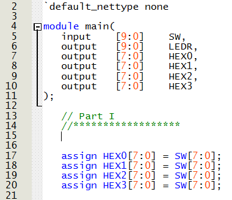
  

</figure>

  <figcaption><em>Figure 1: Verilog Code Screenshot for Part 1 (7 Segment Display Test) </em></figcaption>

  
The following is the video of the working board once the code is uploaded to it.
  

  
  https://github.com/user-attachments/assets/3fbd99eb-574e-421a-b90e-b2b73be113b2
  <figcaption><em>Video 1: Video of Board with 7 Segment Display Test</em></figcaption>

  

After that, a decoder is designed to convert a BCD number (0-9) to a 7 Segment Display input. The circuit was first simulated on Logisim.
The simulated circuit can be seen below in Figure 2.

<figure>
  

    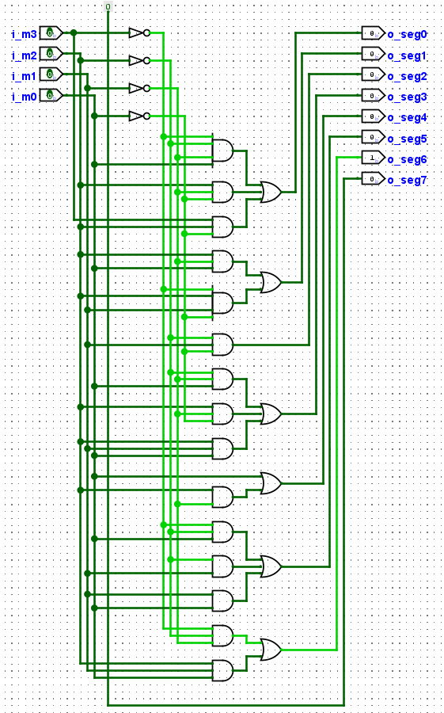
  

</figure>

  <figcaption><em>Figure 2: Logisim Screenshot for Part 1 (7 Segment Display Decoder) </em></figcaption>

  

That is then coded in Verilog and uploaded to the Development Board. The code can be seen in Figure 3 and the working Board can be seen in Video 2.
<figure>
  

    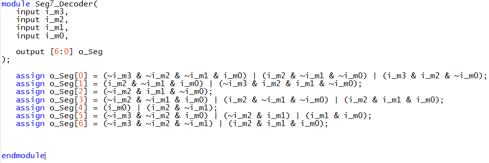
  

</figure>

  <figcaption><em>Figure 3: Submodule Code Screenshot for Part 1 (7 Segment Display Decoder) </em></figcaption>

  
Once this submodule was referenced in the top module and uploaded to the Development Board, Video 2 was taken showing the Decoder Function.
  

  https://github.com/user-attachments/assets/01fcaebe-36aa-4da1-ae1c-97a89cae375c
  <figcaption><em>Video 2: Video of Board with 7 Segment Display Decoder</em></figcaption>

  

## Part II
Next, in Part II, we design a BCD to Decimal Converter that uses for input bits and converts them to 2 7-Segment Display outputs.

The following image shows the structur of the top-module whose code was already provided. The task was to complete the logic for all submodules.
<figure>
  

    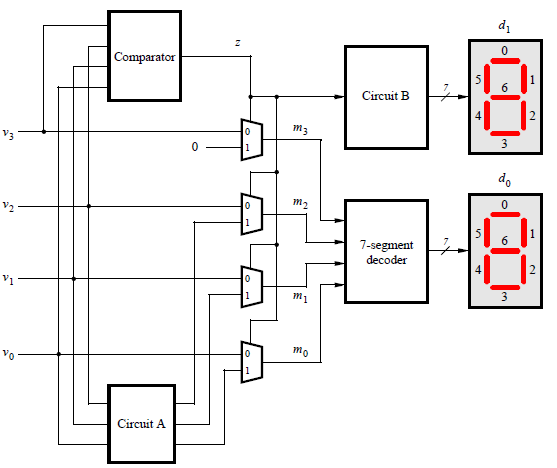
  

</figure>

  <figcaption><em>Figure 4: Block Diagram for Top Module of Part 2 </em></figcaption>

  

Circuit A, Circuit B and the Comparator were then created on Logisim and connected as in Figure 4. The Logisim images for Circuit A, Circuit B,
and the comparator can be seen below in Figures 5, 6 and 7 as well as the working Top Module in Video 3

<figure>
  

    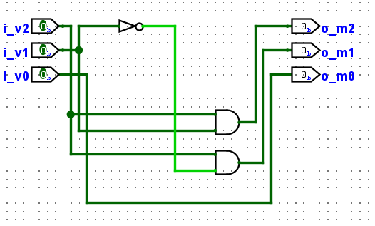
  

</figure>

  <figcaption><em>Figure 5: Logisim for Circuit A Submodule of Part 2 </em></figcaption>

  

<figure>
  

    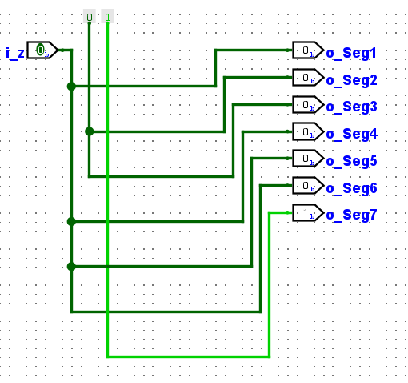
  

</figure>

  <figcaption><em>Figure 6: Logisim for Circuit B Submodule of Part 2 </em></figcaption>

  

<figure>
  

    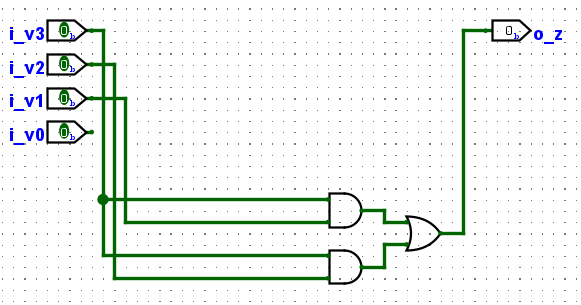
  

</figure>

  <figcaption><em>Figure 7: Logisim for Comparator Submodule of Part 2 </em></figcaption>

  

  
  
  <figcaption><em>Video 2: Video of Logisim Simulation of the Top Module of Part 2</em></figcaption>

  

The code was then written for each of these submodules as follows in Figures 8, 9 and 10.
<figure>
  

    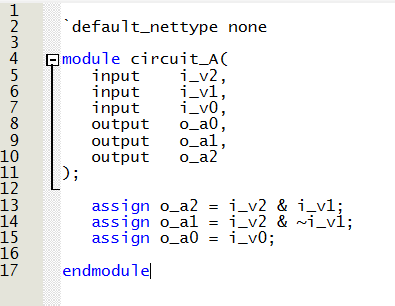
  

</figure>

  <figcaption><em>Figure 8: Code for CircuitA Submodule of Part 2 </em></figcaption>

  

<figure>
  

    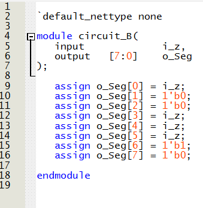
  

</figure>

  <figcaption><em>Figure 9: Code for CircuitB Submodule of Part 2 </em></figcaption>

  

<figure>
  

    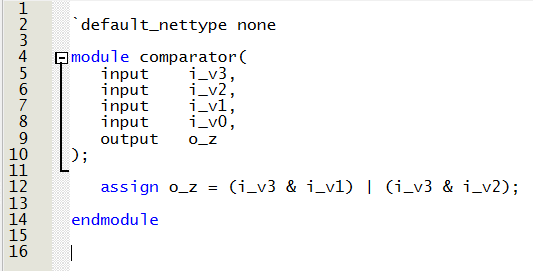
  

</figure>

  <figcaption><em>Figure 10: Code for Comparator Submodule of Part 2 </em></figcaption>

  

Next the top module was then used in the main and uploaded to the Developmenmt Board. A demonstration on the function can be seen below in Video 3.

  
  https://github.com/user-attachments/assets/262834f7-c997-4c50-b6dd-74f950347ef3
  <figcaption><em>Video 3: Video of working Development Board for Part 2</em></figcaption>

  

## Part III

Part III aims at creating a 4-bit ripple carry adder by first creating a Full adder submodule that is then cascaded 4 times to create the 4-bit adder.

### a) Full Adder
The Full-adder logisim simulation first created can be seen below in Video 4 below.

  
  
  <figcaption><em>Video 4: Video of Logisim Simulation for Full Adder in Part 3</em></figcaption>

  

The following was then coded using Verilog HDL and tested on the development board using switches as inputs. The code can be seen in Figure 11 and 
the uploaded board test can be seen in Video 5.

<figure>
  

    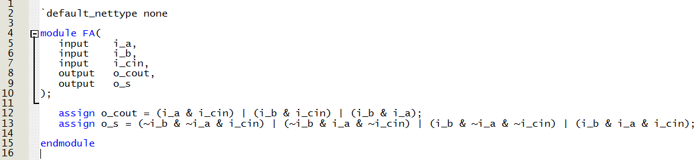
  

</figure>

  <figcaption><em>Figure 11: Code for FA Submodule of Part 3 </em></figcaption>

  

  
  https://github.com/user-attachments/assets/18a73944-6857-47d9-947c-6ad08d8105d5
  <figcaption><em>Video 5: Video of Working Development Board for Full Adder in Part 3</em></figcaption>

  

### b) 4-bit Ripple Carry Adder
The 4-bit ripple carry adder was first created on Logisim by using 4 Full adders from a of this part of the lab. This can be seen in Figure 12.

<figure>
  

    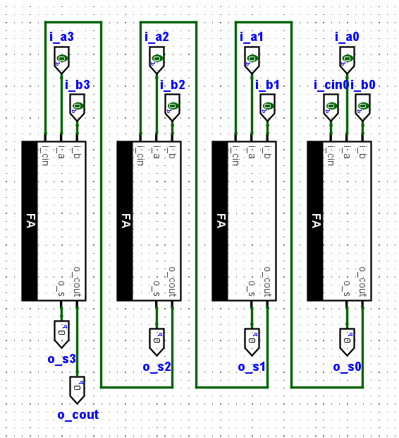
  

</figure>

  <figcaption><em>Figure 12: Logisim for 4-bit Ripple Carry Adder of Part 3 </em></figcaption>

  

This was then coded as shown in Figure 13.

<figure>
  

    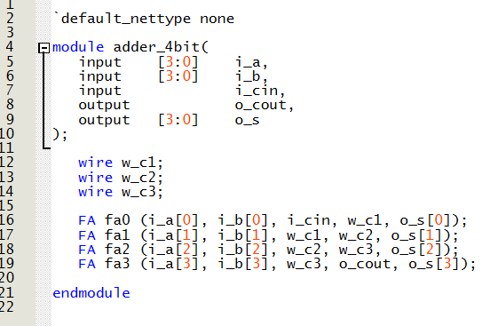
  

</figure>

  <figcaption><em>Figure 13: Code for 4-bit Ripple Carry Adder of Part 3 </em></figcaption>

  

This code was then uploaded to the Development Board and the results can be seen below in Video 6.

  https://github.com/user-attachments/assets/31051257-5c58-4cae-8944-d12606865af9
  <figcaption><em>Video 6: Video of Working Development Board for 4-bit Ripple Carry Adder in Part 3</em></figcaption>

  

## Part IV
Part 4 Creates a BCD Adder. In order to do that, many previously created submodules were used as well as new slightly improved versions of old 
created submodules (circuitA_v2, bin_2_dec_v2) along with the new CheckBCD submodule.
The top module of the BCD adder Simulation on Logisim can be seen below in Video 7.

  
  <figcaption><em>Video 7: Video of BCD Adder Simulation on Logisim</em></figcaption>

  

Videos 8, 9, 10, and 11 show the operations of submodules Bin2Dec_v2, CheckBCD, CircuitA_v2, and Circuit C resectively.

  
  <figcaption><em>Video 8: Video of Bin2Dec_v2 Submodule Simulation on Logisim</em></figcaption>

  
  <figcaption><em>Video 9: Video of CheckBCD Submodule Simulation on Logisim</em></figcaption>

  

  
  <figcaption><em>Video 10: Video of CircuitA_v2 Submodule Simulation on Logisim</em></figcaption>

  
  <figcaption><em>Video 11: Video of CircuitC Submodule Simulation on Logisim</em></figcaption>

The code for the corresponding submodules and Top Module can be seen below in Figures 14, 15, 16, 17 and 18 below.

<figure>
  

    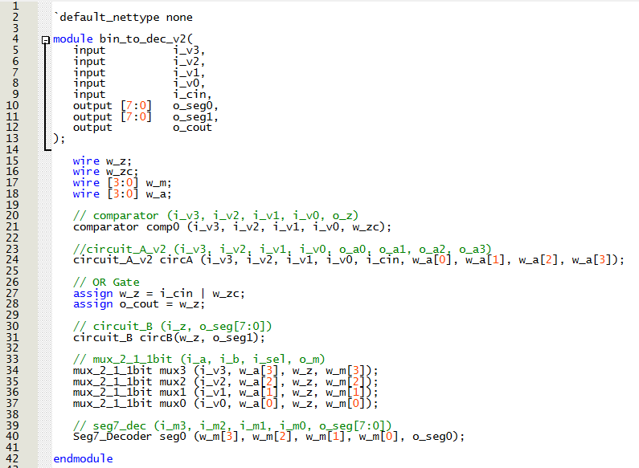
  

</figure>

  <figcaption><em>Figure 14: Code for Bin2Dec_v2 Submodule of Part 4 </em></figcaption>

  

<figure>
  

    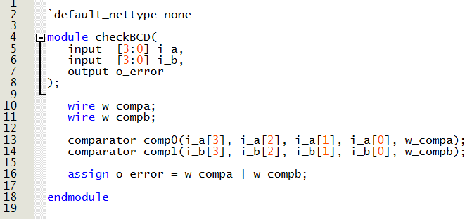
  

</figure>

  <figcaption><em>Figure 15: Code for CheckBCD Submodule of Part 4 </em></figcaption>

  

<figure>
  

    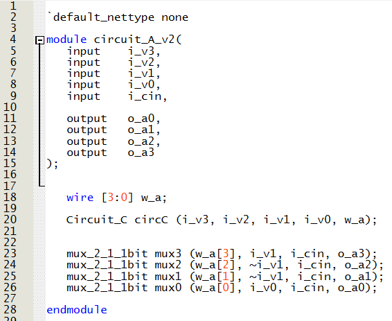
  

</figure>

  <figcaption><em>Figure 16: Code for CircuitA_v2 Submodule of Part 4 </em></figcaption>

  

<figure>
  

    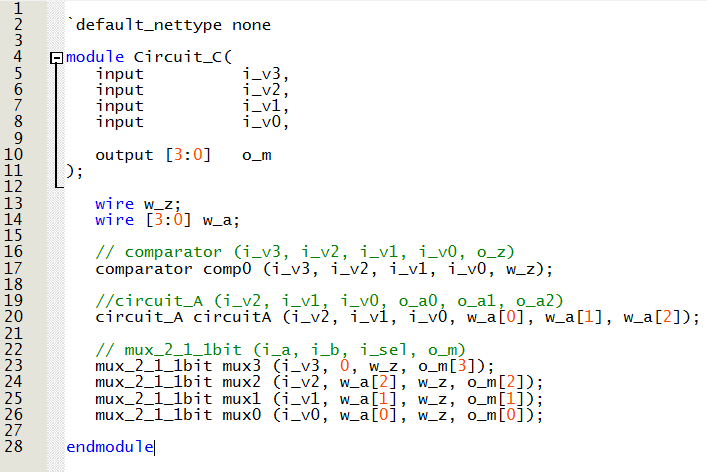
  

</figure>

  <figcaption><em>Figure 17: Code for CircuitC Submodule of Part 4 </em></figcaption>

  

<figure>
  

    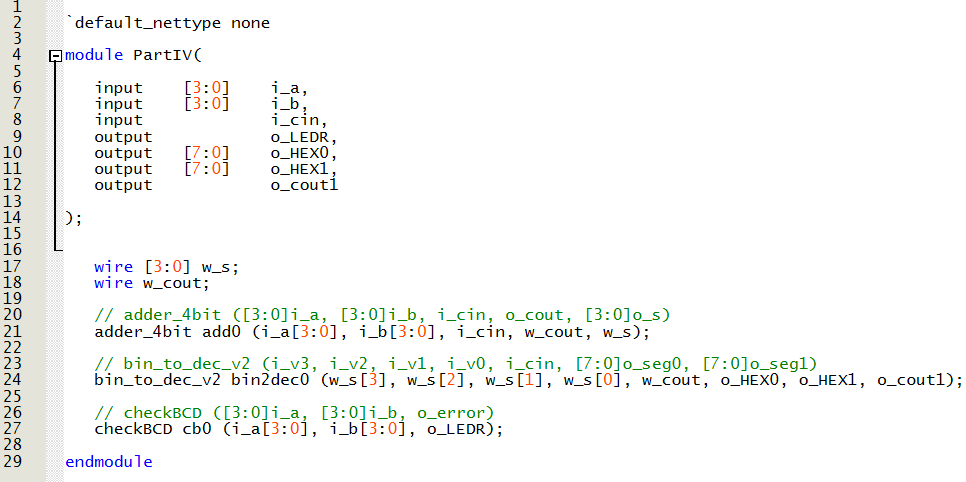
  

</figure>

  <figcaption><em>Figure 18: Code for Part 4 as a Submodule </em></figcaption>

  

The Top Module of Part 4 was then uploaded onto the Development Board and the functioning Board can be seen below in Video 12.

  https://github.com/user-attachments/assets/f29dcd94-90a6-485a-aa99-262bd3be2668
  <figcaption><em>Video 12: Video of Development Board for Part 4</em></figcaption>

## Part V
In Part 5, we are creating a circuit that uses the top module of Part 4 as a submodule to add 2 two-digit BCD numbers
