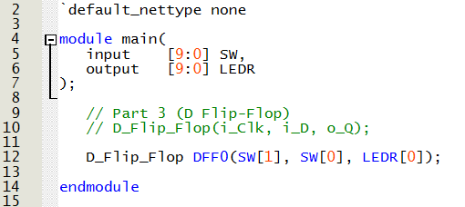

# Lab 3 Report
## Introduction
In this lab, we are investigating latches, flip-flops and registers and attempting to create them on an FPGA Board. The lab includes 5 parts
which create and use a gated SR Latch, a gated D Latch and a D Flip-Flop.

## Part I: Gated SR Latch
In this part, we are making a gated SR Latch which has 3 inputs (set, reset, and clock) with outputs Qa and Qb where Qb is the inverse of Qa.
The following circuit in Figure 1 can be implemented using Verilog code to synthesize a gated SR Latch.
  

<figure>
  

    
  

</figure>

  <figcaption><em>Figure 1: Circuit Diagram for a Gated SR Latch </em></figcaption>

  

The circuit was then simulated using Logisim. A video of the working circuit can be seen below in Video 1.

  
  
  <figcaption><em>Video 1: Video of Logisim Simulation for SR Latch</em></figcaption>

  

The Verilog code was then written using the Quartus software. The written code can be seen below in Figure 2.
<figure>
  

    
  

</figure>

  <figcaption><em>Figure 2: Gated SR Latch Submodule Code </em></figcaption>

  

The synthesized circuit as seen in the RTL viewer can be seen below in Figure 3.
<figure>
  

    
  

</figure>

  <figcaption><em>Figure 3: Gated SR Latch RTL Viewer </em></figcaption>

  

The main code can be seen below in Figure 4.
<figure>
  

    
  

</figure>

  <figcaption><em>Figure 4: Gated SR Latch main Code </em></figcaption>

  

The code was uploaded to the DE10-Lite Development board and the results can be seen below in Video 2.

  
  https://github.com/user-attachments/assets/2b66c7fa-5d8c-452c-8561-41122b365de1
  <figcaption><em>Video 2: Video of Part 1 on Development Board</em></figcaption>

  

## Part II: Gated D Latch

In this part, we are making a gated D Latch which has 2 inputs (D, and clock) with outputs Qa and Qb where Qb is the inverse of Qa.

The circuit was then simulated using Logisim. A video of the working circuit can be seen below in Video 3.

  
  
  <figcaption><em>Video 3: Video of Logisim Simulation for D Latch</em></figcaption>

  

The Verilog code was then written using the Quartus software. The written code can be seen below in Figure 5.
<figure>
  

    
  

</figure>

  <figcaption><em>Figure 5: Gated D Latch Submodule Code </em></figcaption>

  

The synthesized circuit as seen in the RTL viewer can be seen below in Figure 6.
<figure>
  

    
  

</figure>

  <figcaption><em>Figure 6: Gated D Latch RTL Viewer </em></figcaption>

  

The main code can be seen below in Figure 7.
<figure>
  

    
  

</figure>

  <figcaption><em>Figure 7: Gated D Latch main Code </em></figcaption>

  

The code was uploaded to the DE10-Lite Development board and the results can be seen below in Video 4.

  
  https://github.com/user-attachments/assets/732604c6-ba43-45ab-8ca1-76af4f9fce80
  <figcaption><em>Video 4: Video of Part 2 on Development Board</em></figcaption>

  

## Part III: D Flip-Flop

In this part, we are making a D Flip-Flop which has 2 inputs (D, and clock) with output Q and uses two D latches with opposite clocks.

The circuit was then simulated using Logisim. A video of the working circuit can be seen below in Video 5.

  
  
  <figcaption><em>Video 5: Video of Logisim Simulation for D Flip-Flop</em></figcaption>

  

The Verilog code was then written using the Quartus software. The written code can be seen below in Figure 8.
<figure>
  

    
  

</figure>

  <figcaption><em>Figure 8: D Flip-Flop Submodule Code </em></figcaption>

  

The main code can be seen below in Figure 9.
<figure>
  

    
  

</figure>

  <figcaption><em>Figure 9: D Flip-Flop main Code </em></figcaption>

  

The code was uploaded to the DE10-Lite Development board and the results can be seen below in Video 6.

  https://github.com/user-attachments/assets/09cebaa5-f5f8-427f-a07d-9882ee0eea37
  <figcaption><em>Video 5: Video of Part 3 on Development Board</em></figcaption>

  

## Part IV

In this part, we are using a gated D Latch a negative edge trigger D Flip-Flop and a positive edge trigger D Flip-Flop to make a logic circuit
The following circuit in Figure 10 shows how the latch and flip-flops are used in this part.
  

<figure>
  

    
  

</figure>

  <figcaption><em>Figure 10: Circuit Diagram for Part 4</em></figcaption>

  

The circuit was then simulated using Logisim. A video of the working circuit can be seen below in Video 6.

  
  
  <figcaption><em>Video 6: Video of Logisim Simulation for Part 4</em></figcaption>

  

The Verilog code was then written using the Quartus software. The written code can be seen below in Figure 11.
<figure>
  

    
  

</figure>

  <figcaption><em>Figure 11: Code for Part 4 main</em></figcaption>

  

The code was uploaded to the DE10-Lite Development board and the results can be seen below in Video 7.

  
  https://github.com/user-attachments/assets/fa36eb43-782b-4285-8205-a570d5ee8b0e
  <figcaption><em>Video 7: Video of Part 4 on Development Board</em></figcaption>

  
