# Lab 4 Report
Lab 4 is intended to use an FPGA on the DE10-Lite Development Board to create, test and use counters.
## Part I
This part of the lab uses cascaded T Flip-Flops to create an 8-bit counter. Figure 1 shows the provided circuit that forms the logic of a 4-bit counter using 
the T Flip-Flops. Eventhough Figure 1 shows a 4-bit counter instead of an 8-bit counter, the way the T Flip-Flops are cascaded is the same.

  
<figure>
  

    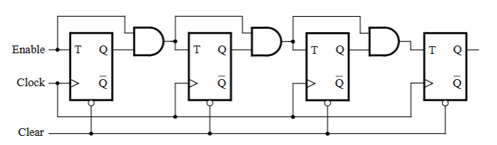
  

</figure>

  <figcaption><em>Figure 1: Circuit Diagram of 4 bit Counter </em></figcaption>

  

The T Flip Flop was first coded on its own as a submodule. The following code can be seen below in Figure 2

  
<figure>
  

    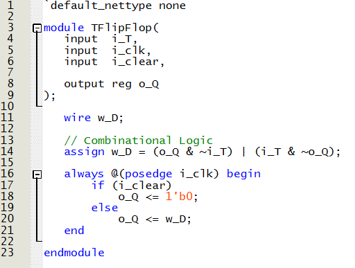
  

</figure>

  <figcaption><em>Figure 2: T Flip-Flop Submodule Code </em></figcaption>

  

The 8 bit counter is then coded and tested using the 1 second counter from a previous lab as the clock. The corresponding code for the 8 bit counter can be 
seen below in Figure 3.

  
<figure>
  

    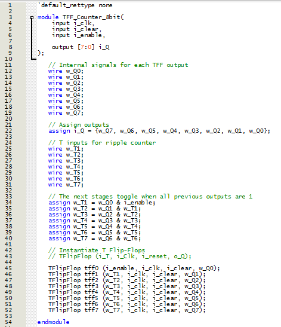
  

</figure>

  <figcaption><em>Figure 3: 8 bit Counter Submodule Code </em></figcaption>

  

The following was uploaded onto the development board and the resulting video was captured. Initially, the debounced button (KEY0) was used as the clock as 
instructed in the lab document, but there still remained some level of bouncing because the counter would skip values even though it was confirmed to have 
been functioning correctly using the 1s counter. Video 1 shows the counter with the output shown in the LED array. 
58 Logic Elements (LEs) were used to implement this circuit.

  
  <figcaption><em>Video 1: Video of T Flip Flop Counter Uploaded to Development Board</em></figcaption>

  

The 7 Segment decoder was then added to the main code to convert the output of the 8 bit counter to a hexadecimal 2 digit value that can be displayed on the 
7 segment displays. The submodule code for the 7-Segment Display decoder can be seen below in Figure 4.
Part1_Seg7_dec_Submodule

<figure>
  

    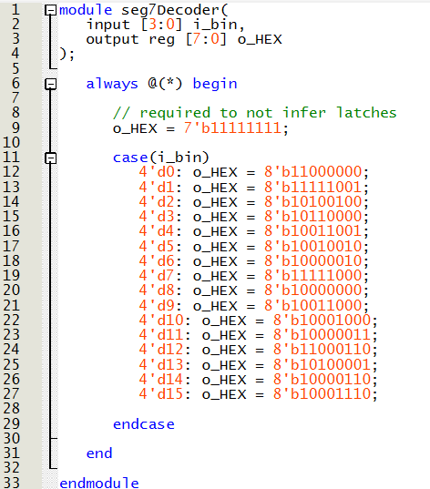
  

</figure>

  <figcaption><em>Figure 7: 7-Segment Display decoder Submodule Code </em></figcaption>

  

The newest version of the code seen in Figure 7 was uploaded onto the development board. The captured video can be seen below in Video 2.

  
  <figcaption><em>Video 2: Video of Counter with Hex Output Uploaded to Development Board</em></figcaption>

  

The 4 bit version of this counter was then created and synthesized. The synthesized RTL view of the ciruit can be seen below in Figure 8.

<figure>
  

    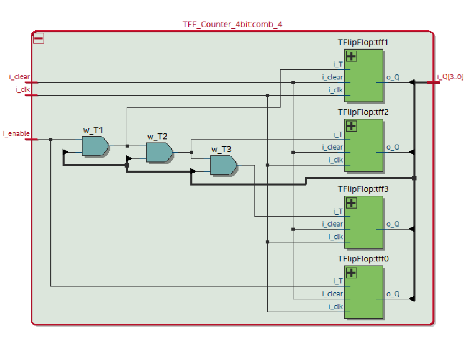
  

</figure>

  <figcaption><em>Figure 8: 4 bit Counter RTL View </em></figcaption>

  

## Part II
In this part, we are required to implement a 16 bit counter using a different method by adding 1 to a register. An image of the submodule containing the new 
method of coding the counter can be seen below in Figure 9.

<figure>
  

    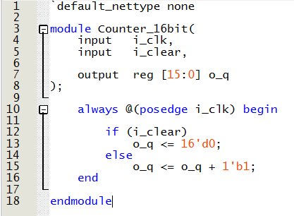
  

</figure>

  <figcaption><em>Figure 9: 16 bit Counter Submodule</em></figcaption>

  

This was used to generate a 4 digit hex value on the seven segment displays and the code was uploaded to confirm the function of the submodule. 
The total number of LEs needed is 93 and the RTL viewer of this part can be seen below in Figure 10.

<figure>
  

    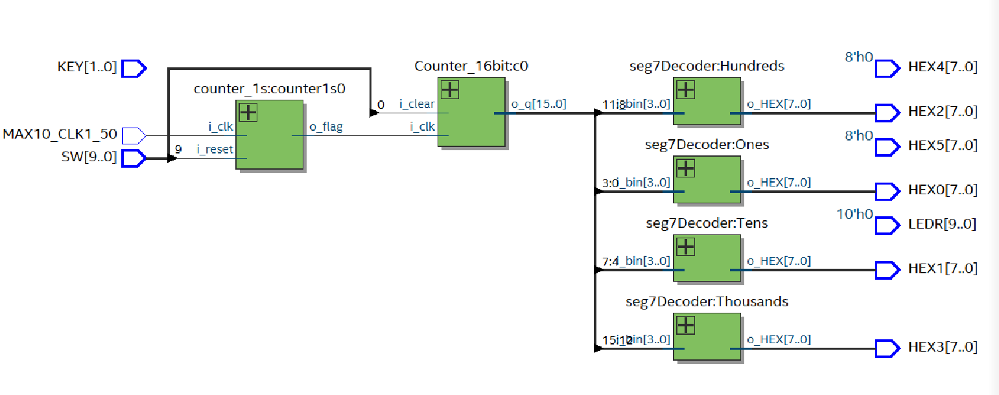
  

</figure>

  <figcaption><em>Figure 10: 16 bit Counter RTL View </em></figcaption>

  

## Part III
In this part, we are again implementing a counter but using the LPM (Library of Parameterized Modules). Due to a lack of subscription, we are unable to view
the library on quartus, but we can still open the file on a text reader such as notepad to identify the inputs and outputs. Figure 11 below shows the parameters
of the library and how it is used in the top module.

<figure>
  

    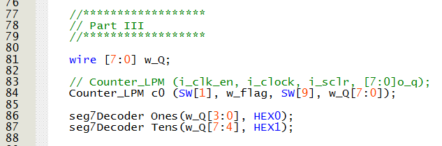
  

</figure>

  <figcaption><em>Figure 11: LPM Counter Top Module Code </em></figcaption>

  

## Part IV
In Part 4, the goal is to use the LPM from part 3 along with some basic logic to create a circuit that counts from 0 to 9 and then resets while showing those 
values on the 7 segment displays.

Figure 12 shows the top module of the following part.

<figure>
  

    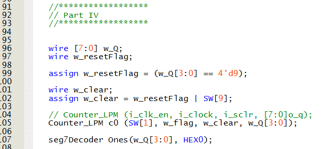
  

</figure>

  <figcaption><em>Figure 12: LPM Counter Resetting at 9 Top Module Code </em></figcaption>

  

The following was synthesized and uploaded to the development to view and confirm function. The functioning board can be seen in Video 3.

  
  <figcaption><em>Video 3: Video of LPM Counter up to 9 Uploaded to Development Board</em></figcaption>

  

## Part V
Part 5 and the final part of this lab was to use a counter to implement a rotation of the word "HELLO" once per second.
In order to do that, a submodule with the name rotatingHello is used to convert the counter value to the correct letter configuration. The counter is then used
and reset whenever it reaches the decimal value 5 to allow the word to continue cycling through without repetitive logic.
Figure 13 below shows the code for the rotatingHello submodule.

<figure>
  

    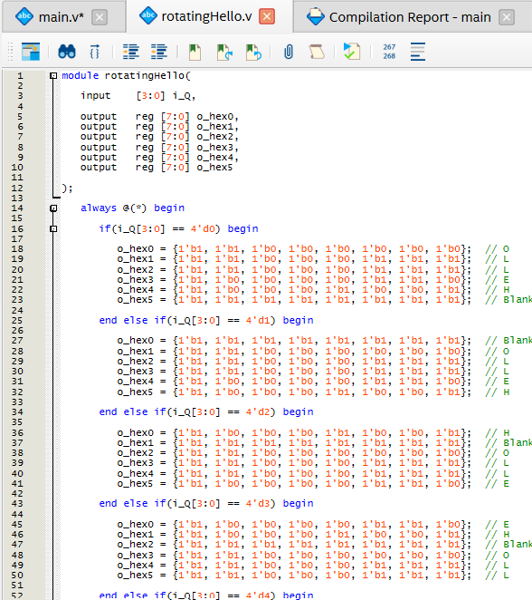
  

</figure>
<figure>
  

    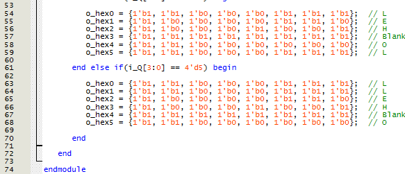
  

</figure>

  <figcaption><em>Figure 13: rotatingHello Submodule Code </em></figcaption>

  

The top module code for part 5 can be seen in Figure 14.

<figure>
  

    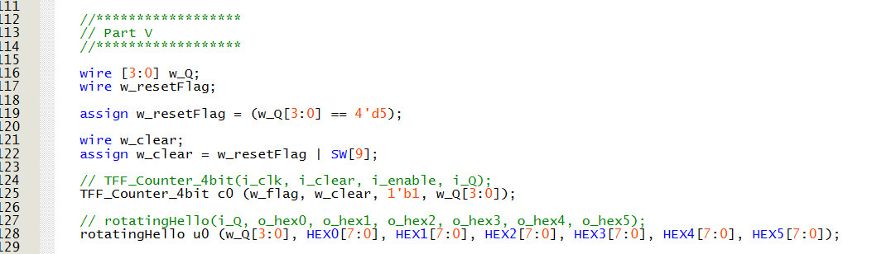
  

</figure>

  <figcaption><em>Figure 14: Part 5 Top Module Code </em></figcaption>

  

The following code was synthesized and uploaded to the development board. The output was recorded and can be seen below in video 4.

  
  <figcaption><em>Video 4: Video of Part 5 Uploaded to Development Board</em></figcaption>

  
