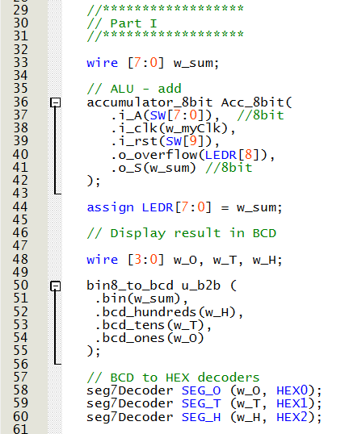

# Lab 5 Report
This lab is intended to create and test arithmetic operations such as addition, subtraction, multiplication and division.

## Part I
In part 1 of this lab, we are creating an 8-bit accumulator to carry out the addition operation. The circuit diagram for the accumulator can be seen in Figure 1.

  
<figure>
  

    
  

</figure>

  <figcaption><em>Figure 1: Circuit Diagram of 8-bit Accumulator </em></figcaption>

  

The submodule for the accumulator uses nbit_registers and an 8-bit ALU.
The code for the n-bit register submodule can be seen below in Figure 2.

  
<figure>
  

    
  

</figure>

  <figcaption><em>Figure 2: n-bit Register Submodule Code </em></figcaption>

  

The full verilog code written for the 8-bit accumulator submodule can be seen below in Figure 3. 

  
<figure>
  

    
  

</figure>

  <figcaption><em>Figure 3: 8-bit Accumulator Submodule Code </em></figcaption>

  

The RTL view for the submodule can be seen below in Figure 4.

  
<figure>
  

    
  

</figure>

  <figcaption><em>Figure 4: 8-bit Accumulator Submodule RTL View </em></figcaption>

  

The 8-bit Accumulator was then incorporated into the top module and the code for the part 1 top module can be seen below in figure 5.

  
<figure>
  

    
  

</figure>

  <figcaption><em>Figure 5: Part 1 Top Module Code </em></figcaption>

  

The top module was then synthesized and the RTL View was generated as can be seen below in Figure 6.

  
<figure>
  

    
  

</figure>

  <figcaption><em>Figure 6: Part 1 Top Module RTL View </em></figcaption>

  

When the top module was uploaded to the DEI-10 Lite development board, the code was demonstrated to be working correctly. The only issue is
that this submodule, is not able to identify and carry out subtraction of two numbers. Another submodule is created in Part II below to 
allow both addition and subtraction.

## Part II
In order to carry out subtraction, a variable called add_sub is added as an input to the submodule and if add_sub is equal to 1, subtaction
is carried out. Otherwise, the submodule carries out normal addition as shown above in Part I.

The full verilog code written for the 8-bit accumulator submodule with subtraction capabilities can be seen below in Figure 7. 

  
<figure>
  

    
  

</figure>

  <figcaption><em>Figure 7: 8-bit Accumulator with Subtraction Submodule Code </em></figcaption>

  

The RTL view for the submodule can be seen below in Figure 8.

  
<figure>
  

    
  

</figure>

  <figcaption><em>Figure 8: 8-bit Accumulator with Subtraction Submodule RTL View </em></figcaption>

  

The 8-bit Accumulator with subtraction was then incorporated into the top module and the code for the part 2 top module can be seen below in figure 9.

  
<figure>
  

    
  

</figure>

  <figcaption><em>Figure 9: Part 2 Top Module Code </em></figcaption>

  

The top module was then synthesized and the RTL View was generated as can be seen below in Figure 10.

  
<figure>
  

    
  

</figure>

  <figcaption><em>Figure 10: Part 2 Top Module RTL View </em></figcaption>

  

## Part III

Next, we attempted to synthesize a circuit that can carry out multiplication arithmetic by using the shift and add method using a circuit called the array multiplier.

The circuit diagram for the array multiplier can be seen in Figure 11.

  
<figure>
  

    
  

</figure>

  <figcaption><em>Figure 11: Circuit Diagram of array multiplier </em></figcaption>

   
<figure>
  

    
  

</figure>

<figure>
  

    
  

</figure>

  <figcaption><em>Figure 12: 4-bit Array Multiplier Submodule Code </em></figcaption>

  

The RTL view for the submodule can be seen below in Figure 13.

  
<figure>
  

    
  

</figure>

  <figcaption><em>Figure 8: 4-bit Array Multiplier Submodule RTL View </em></figcaption>

  

## Part IV

