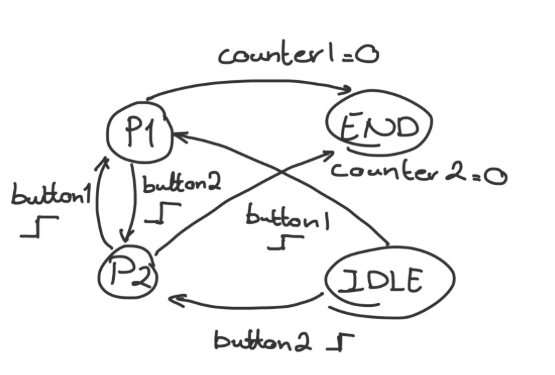
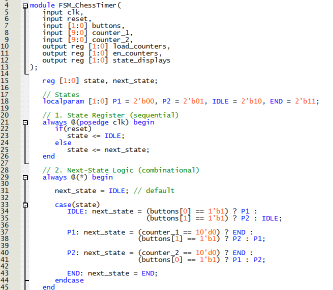
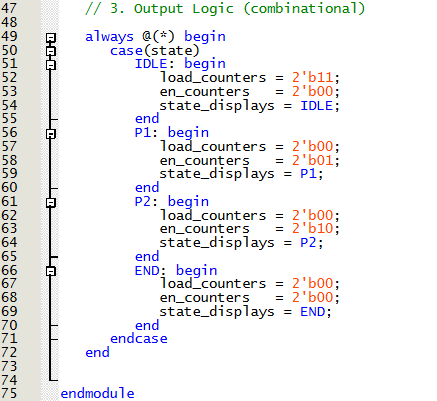
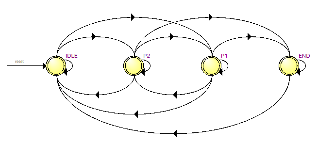
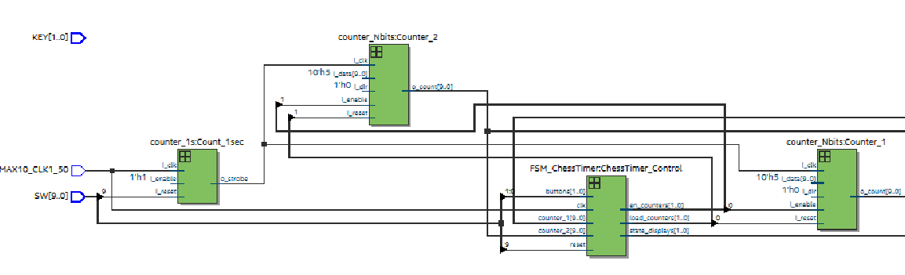

# Lab 6 (Chess Timer)
## FSM Explanation and Diagram
For this Lab we are provided with a template that uses a state machine and 2 counters to control the system given 2 buttons.
The goal of this lab to to design the finite state machine for the circuit to act as a chess timer. The finite state machine design can be seen below in Figure 1.

  
<figure>
  

    
  

</figure>

  <figcaption><em>Figure 1: Finite State Machine State Diagram </em></figcaption>

  

## Code
The code for the Moore Finite State Machine (fsm_chesstimer.v) was written to encapsulate the states and above.
Part 1 of the state machine can be seen below in Figure 2 showing the setup of the submodule, setup of the states and the next-state logic.

  
<figure>
  

    
  

</figure>

  <figcaption><em>Figure 2: Finite State Machine Part 1 </em></figcaption>

  

Part 2 of the state machine can be seen below in Figure 3 showing the output logic.

  
<figure>
  

    
  

</figure>

  <figcaption><em>Figure 3: Finite State Machine Part 2 </em></figcaption>

  

When this code is synthesized, we can look at the RTL Viewer to confirm FSM function. Below, Figure 4 shows the State Diagram that the RTL Viewer produces 
which can be compared to Figure 1 to make sure that the synthesized circuit behaves as intended.

  
<figure>
  

    
  

</figure>

  <figcaption><em>Figure 4: State Diagram as Produced by RTL Viewer </em></figcaption>

  

## Counters

The main code uses 3 different counters: Counter_1s, Counter_1 and Counter_2.
Counter_1s is a counter submodule used to transform the 50MHz internal clock into a 1s counter that can be used to trigger Counter_1 and Counter_2.  

Counter_1 and Counter_2 use the output 1s counter from the third submodule to count down from 5. Both of those couters use the submodule counter_Nbits with the parameter N set to 10
to provide a maximum number of bits of 10 (max decimal number 2047). The limit of the value it counts down from or up to is set by the input "i_data". In our case this is set to 10'd5.
To enable counter_Nbits to count down not up, the input "i_dir" is assigned the constant 1'b0.   

This setup can be seen in the part of RTL viewer of the main showing the counters in Figure 5.

  
<figure>
  

    
  

</figure>

  <figcaption><em>Figure 5: RTL Viewer Showing Counter Connections </em></figcaption>

  

## Results

Video 1 below shows the video of the chess timer working on the development board.

  
  https://github.com/user-attachments/assets/3cda2548-fc36-4428-ab50-a979d12bd431
  <figcaption><em>Video 1: Video of Board with Chess Timer Uploaded</em></figcaption>

