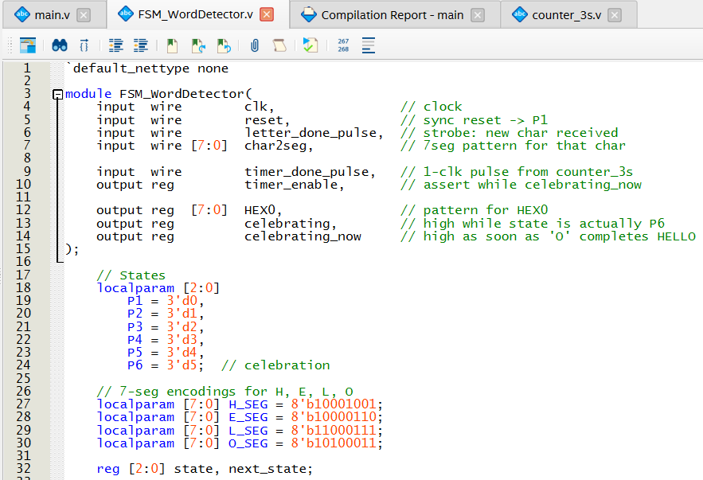
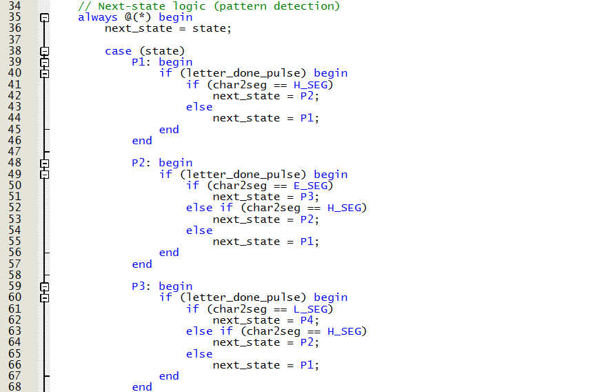
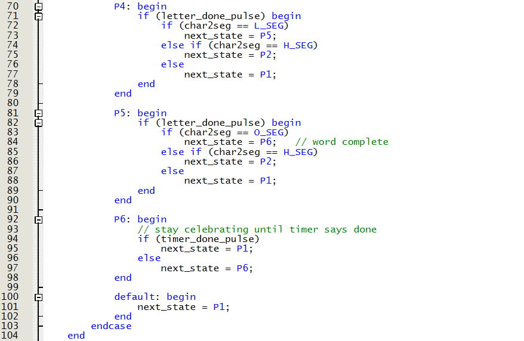
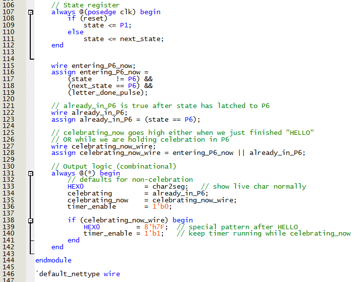
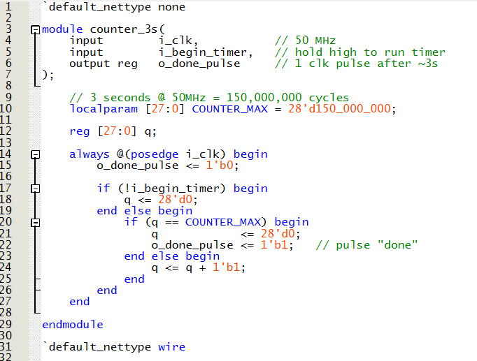
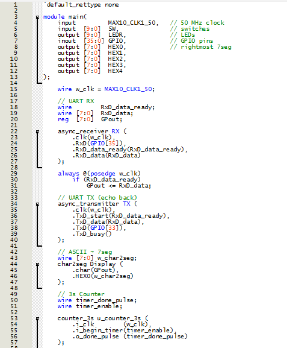
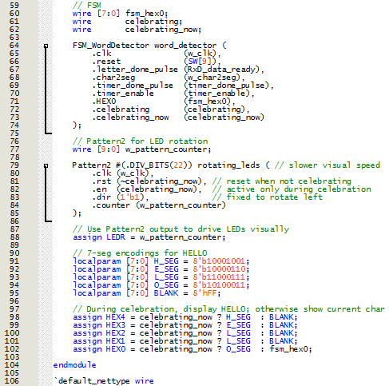

# Lab 7 Report (UART Word Detector)

## Introduction
In this lab, we are creating a word detector that uses UART protocol to input any letter or number in ascii and if the word "hello" is detected, the full word 
along with rotating lights flash for 3 seconds. during the undetected states, the system should display the letters and numbers that the user inputs.

## State Machine
Below, image 1 shows the state diagram of the finite state machine.
  
<figure>
  

    
  

</figure>

  <figcaption><em>Figure 1: Finite State Machine State Diagram </em></figcaption>

  

## Main and other submodules
In order to achieve that, we have 2 newly created submodules (the FSM and the 3 second counter). The codes for the Finite state Machine can be seen in Figure 2.
  
<figure>
  

    
  

</figure>
<figure>
  

    
  

</figure>
<figure>
  

    
  

</figure>
<figure>
  

    
  

</figure>

  <figcaption><em>Figure 2: Finite State Machine Code </em></figcaption>

  

The code for the 3s Counter can be seen below in Figure 3.
  
<figure>
  

    
  

</figure>

  <figcaption><em>Figure 3: 3 Second Counter Code </em></figcaption>

  

Finally, the main (Top Module) that incorporates both of thiose submodules and the UART transmitter and receiver submodules as well as the ascii conversion 
submodule can be seen below in Figure 4. 

  
<figure>
  

    
  

</figure>

<figure>
  

    
  

</figure>

  <figcaption><em>Figure 3: Top Module Code </em></figcaption>

  

## Final Results
The final results can be seen below in Video 1.

