# Lab 8: Very Simple Microprocessor

In this lab we are creating a very simple microprocessor that uses a Von Neumann architecture. The diagram for the microprocessor architecture can be seen below in Figure 1.

  
<figure>
  

    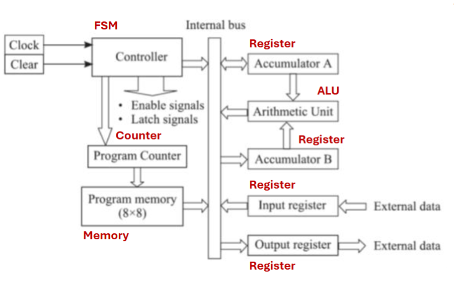
  

</figure>

  <figcaption><em>Figure 1: Diagram for Microprocessor Architecture </em></figcaption>

  

Figure 1 shows all the blocks within the microprocessor which are a controller made of:   
    1. Accumulator A and Accumulator B which are registers that store the data being calculated in the ALU  
    2. An Input Register  
    3. An Output Register  
    4. A program counter which determines what line of code the microprocessor needs to fetch next  
    5. A program memory which stores the instruction after it is fetched and separates it into instruction and data  
    6. An Arithmetic Logic Unit to carry out arithmetic functions Add and Subtract  
    7. FSM which controls the flow of data  

The Microprocessor contains a central data bus called IB_BUS that is accessed by different blocks at different times. The access to the Bus is controlled by enable signals
sent out by the controller. 

A Logisim project was provided by the instructor showing the circuits and the interactions of the controller blocks. The logisim circuit was then converted to Verilog code 
for each block and then controller is finally tested with all the blocks.

The mircoprocessor uses the following phases:   
    1. Get Instruction  
    2. Run Instruction  
    3. Get Data  
    4. Run Data  

where phases 1 and 2 constitute the fetching of the command and phases 3 and 4 constitute the execution of the command. In this microprocessor, 4 clock cycles are needed to 
fetch and execute each command.

## Accumulator A

This accumulator is a register that stores the data value that is received from the instruction until execution for it to be accessed by the ALU quickly. The circuit for 
accumulator A as simulated on Logisim, can be seen below in Figure 2.

  
<figure>
  

    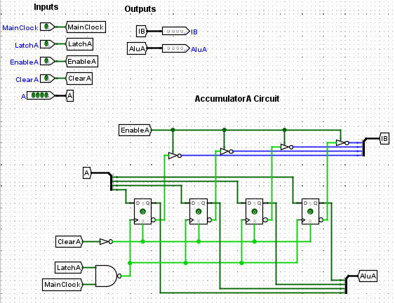
  

</figure>

  <figcaption><em>Figure 2: Logisim Simulation for Accumulator A </em></figcaption>

  

Figure 3 below shows the following circuit when converted to code.

  
<figure>
  

    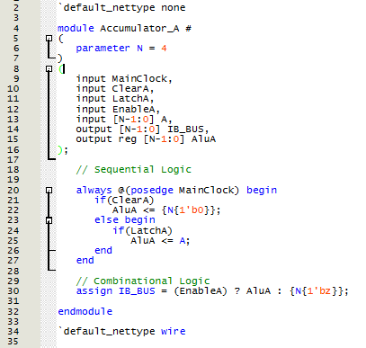
  

</figure>

  <figcaption><em> Figure 3: Code for Accumulator A </em></figcaption>

  

When the code is synthesized, the RTL Viewer can be seen below in Figure 4.

  
<figure>
  

    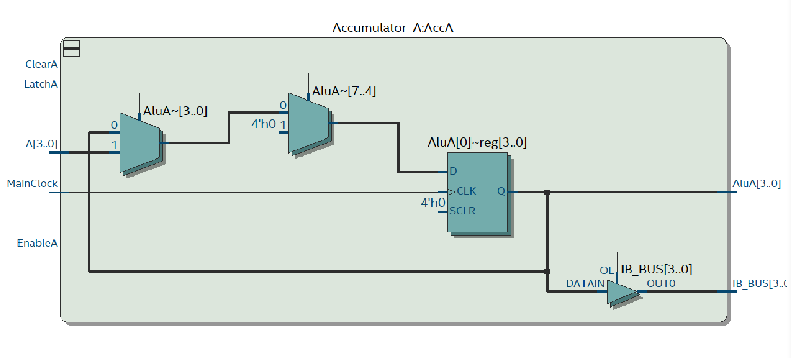
  

</figure>

  <figcaption><em> Figure 4: RTL View for Accumulator A </em></figcaption>

  

## Accumulator B

Accumulator B is the register that stores result from previous execution. This is then used in the next command as the value being added to. The circuit for accumulator B
as simulated on Logisim, can be seen below in Figure 5.

  
<figure>
  

    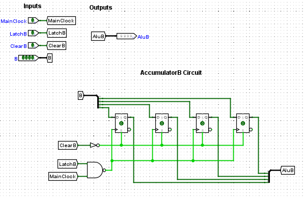
  

</figure>

  <figcaption><em>Figure 5: Logisim Simulation for Accumulator B </em></figcaption>

  

Figure 6 below shows the following circuit when converted to code.

  
<figure>
  

    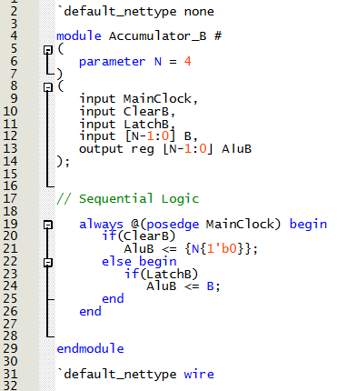
  

</figure>

  <figcaption><em> Figure 6: Code for Accumulator B </em></figcaption>

  

When the code is synthesized, the RTL Viewer can be seen below in Figure 7.

  
<figure>
  

    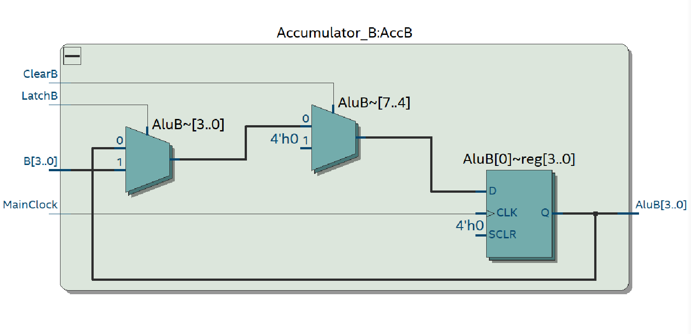
  

</figure>

  <figcaption><em> Figure 7: RTL View for Accumulator B </em></figcaption>

  

## Input Register

The input Register is a register that is made of triodes that separate the input from IB_BUS to prevent errors and is onlly allowed access to the bus when it's enable 
signal is 1. The circuit simulation on Logisim can be seen below in Figure 8.

  
<figure>
  

    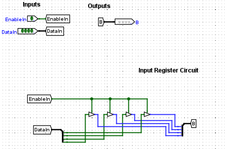
  

</figure>

  <figcaption><em>Figure 8: Logisim Simulation for Input Register </em></figcaption>

  

Figure 9 below shows the following circuit when converted to code. When implementing the Input Register, the input binary number is determined by SW[3:0].

  
<figure>
  

    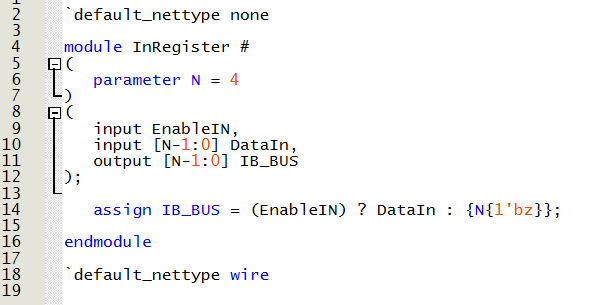
  

</figure>

  <figcaption><em> Figure 9: Code for Input Register </em></figcaption>

  

When the code is synthesized, the RTL Viewer can be seen below in Figure 10.

  
<figure>
  

    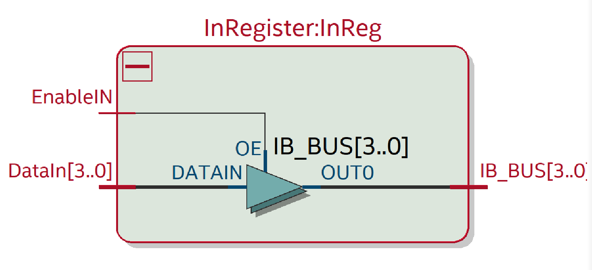
  

</figure>

  <figcaption><em> Figure 10: RTL View for Input Register </em></figcaption>

  

## Output Register

The Output Register is a register that stores the output data until an enable out signal is triggered allowing the register output to latch to the value of IB_BUS. 
The circuit simulation on Logisim can be seen below in Figure 11.

  
<figure>
  

    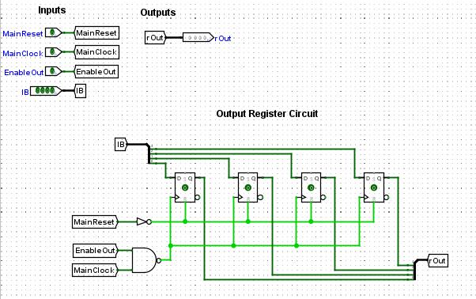
  

</figure>

  <figcaption><em>Figure 11: Logisim Simulation for Output Register </em></figcaption>

  

Figure 12 below shows the following circuit when converted to code. When implementing the Output Register, the output bus is fed into the 7 Segment Display Decoders
to convert them from binary to numbers that the HEX displays can use.

  
<figure>
  

    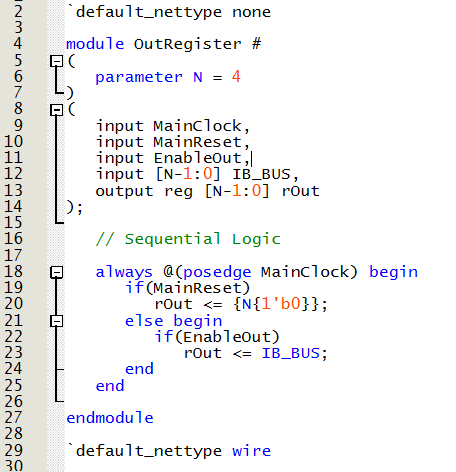
  

</figure>

  <figcaption><em> Figure 12: Code for Output Register </em></figcaption>

  

When the code is synthesized, the RTL Viewer can be seen below in Figure 13.

  
<figure>
  

    
  

</figure>

  <figcaption><em> Figure 13: RTL View for Output Register </em></figcaption>

  

## Program Memory (Instruction Register)

The Instruction Register or Program Memory is a register that stores the data and instruction information until it is given an enable signal that allows it access to 
IB_BUS so that it can send the instruction to the Controller or the Data to the ALU.
Below in Figure 14 is the Logisim simulation circuit.

  
<figure>
  

    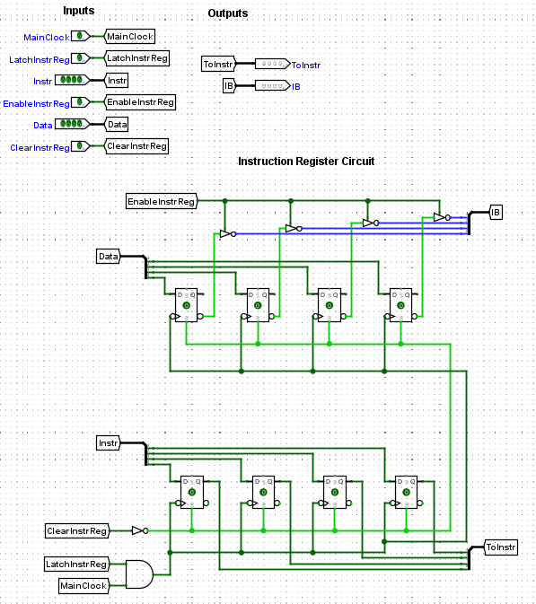
  

</figure>

  <figcaption><em>Figure 14: Logisim Simulation for Instruction Register </em></figcaption>

  

Figure 15 below shows the following circuit when converted to code.

  
<figure>
  

    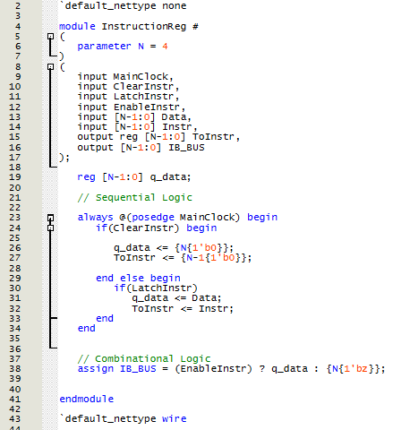
  

</figure>

  <figcaption><em> Figure 15: Code for Instruction Register </em></figcaption>

  

When the code is synthesized, the RTL Viewer can be seen below in Figure 16.

  
<figure>
  

    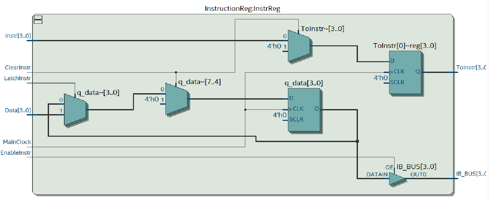
  

</figure>

  <figcaption><em> Figure 16: RTL View for Instruction Register </em></figcaption>

  

## Program Counter

The program counter is a counter that keeps track of and iterates the instruction number that we are on. This counter iterates every 4 clock cycles.
Below in Figure 17 is the Logisim simulation circuit.

  
<figure>
  

    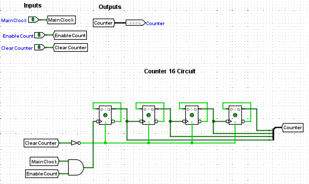
  

</figure>

  <figcaption><em>Figure 17: Logisim Simulation for Program Counter </em></figcaption>

  

Figure 18 below shows the following circuit when converted to code.

  
<figure>
  

    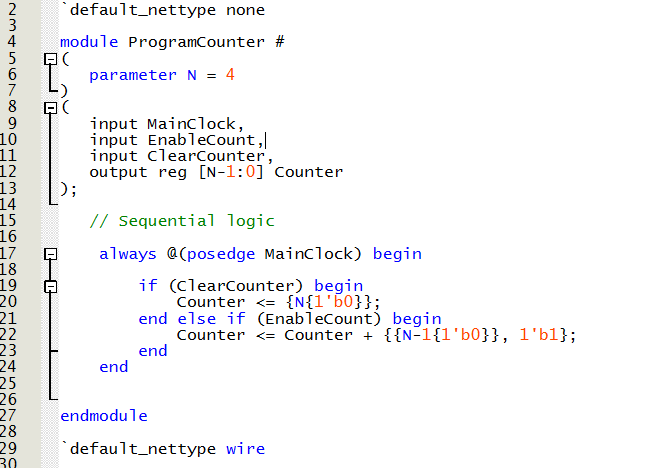
  

</figure>

  <figcaption><em> Figure 18: Code for Program Counter </em></figcaption>

  

When the code is synthesized, the RTL Viewer can be seen below in Figure 19.

  
<figure>
  

    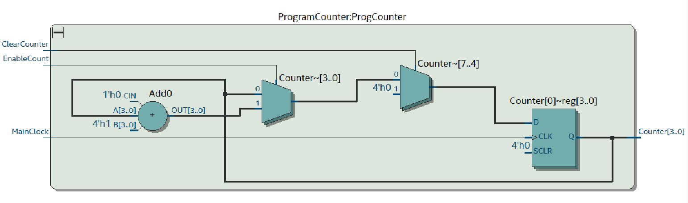
  

</figure>

  <figcaption><em> Figure 19: RTL View for Program Counter </em></figcaption>

  

## ROM Nx8

For the purposes of feeding the code into the system somehow, an Nx8 ROM is created and the code is manually added. In an ideal situation, there would be a way
for us to load the code onto the microprocessor as the system runs. This could be achieved by using UART to communicate commands and data.
Below in Figure 20 is the code for an Nx8 ROM.

  
<figure>
  

    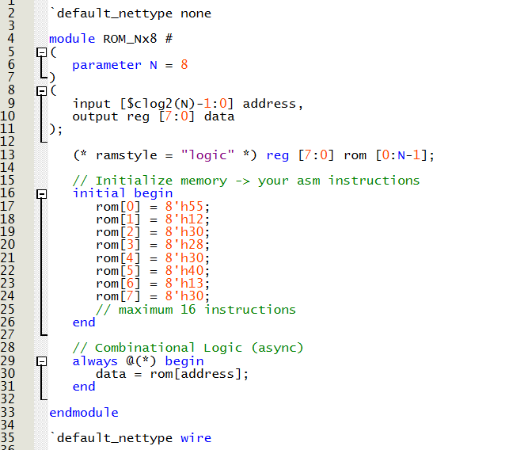
  

</figure>

  <figcaption><em> Figure 20: Code for Nx8 ROM </em></figcaption>

  

When the code is synthesized, the RTL Viewer can be seen below in Figure 21.

  
<figure>
  

    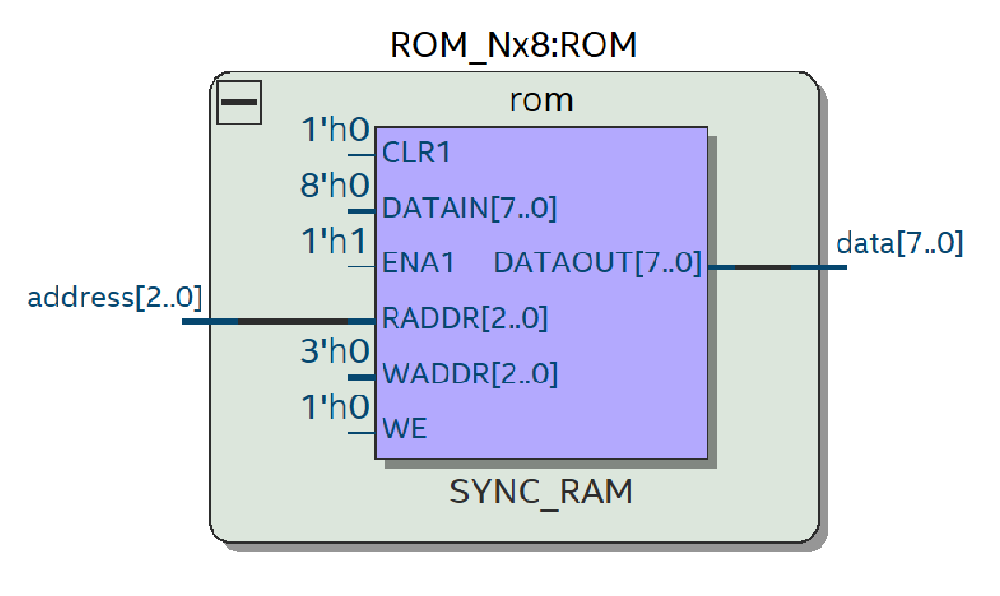
  

</figure>

  <figcaption><em> Figure 21: RTL View for Nx8 ROM </em></figcaption>

  

## Arithmetic Logic Unit

The Arithmetic Logic Unit (ALU) is a machine that handles the addition, subtraction and mathematical operations needed within the microprocessor. To do that,
it interacts with Accumulator A, Accumulator B, and some control signals from the controller. The Logisim simulation circuit for the ALU can be seen below in Figure 22.

  
<figure>
  

    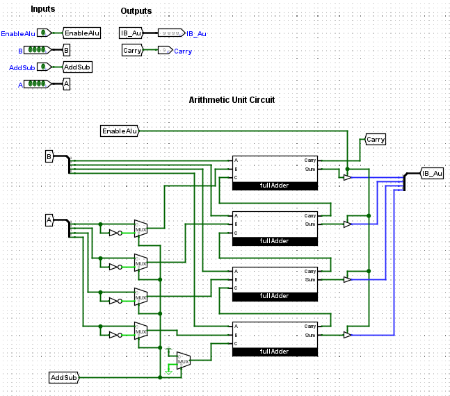
  

</figure>

  <figcaption><em>Figure 22: Logisim Simulation for ALU </em></figcaption>

  

Figure 23 below shows the following circuit when converted to code.

  
<figure>
  

    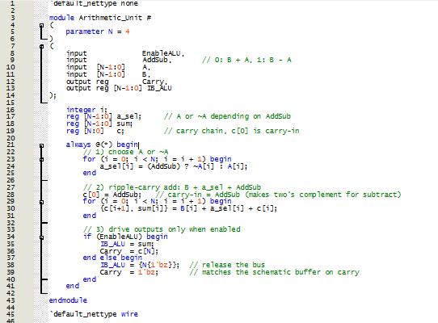
  

</figure>

  <figcaption><em> Figure 23: Code for ALU </em></figcaption>

  

When the code is synthesized, the RTL Viewer can be seen below in Figure 24.

  
<figure>
  

    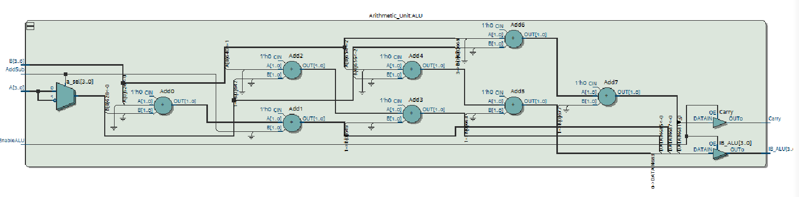
  

</figure>

  <figcaption><em> Figure 24: RTL View for ALU </em></figcaption>

  

## Controller (Finite State Machine)

The command set that we are coding the Controller to be able to handle is:   
    1. NOP  ------> No Change (ex. 8'b0000_0000)  
    2. ADD  ------> Adds Accumulator A to Accumulator B (ex. 8'b0001_0011)  
    3. SUB  ------> Subtracts Accumulator A from Accumulator B (ex. 8'b0010_0100)  
    4. OUT  ------> Outputs Data currently in Accumulator B (ex. 8'b0011_0000)  
    5. IN   ------> Gets Input data from Switches (ex. 8'b0100_0000)  
    6. LDA  ------> Loads number to Accumulator A (ex. 8'b0101_1001)  

The finite state machine was not simulated directly using Logisim because Logisim lacks the ability to create state diagrams, the code however can be seen below 
in Figure 25.

  
<figure>
  

    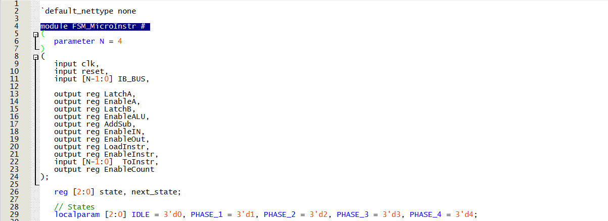
  

</figure>
<figure>
  

    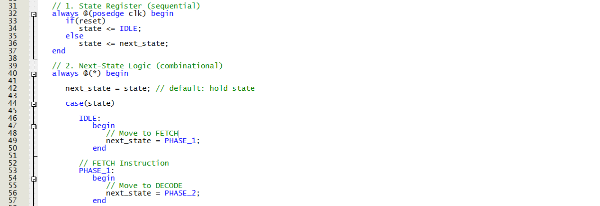
  

</figure>
<figure>
  

    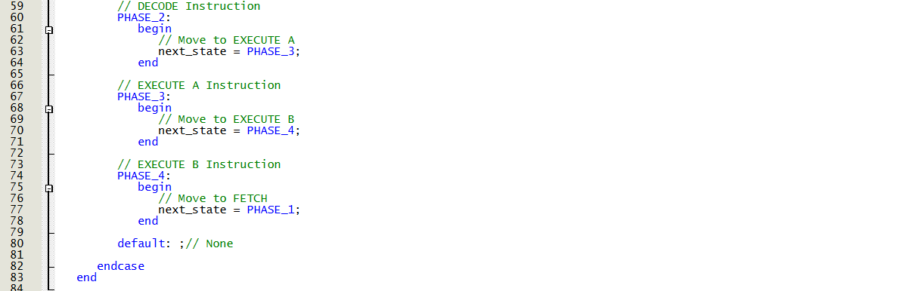
  

</figure>
<figure>
  

    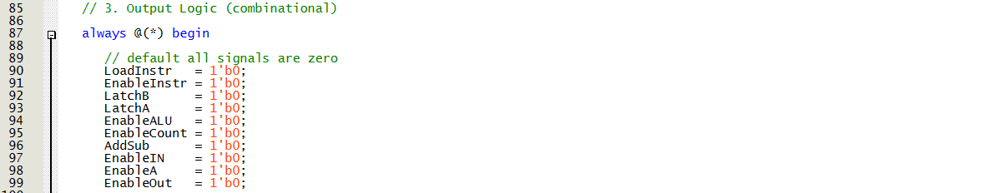
  

</figure>
<figure>
  

    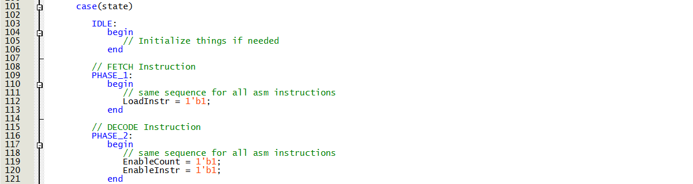
  

</figure>
<figure>
  

    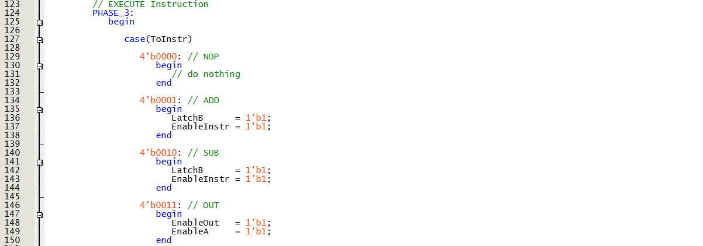
  

</figure>
<figure>
  

    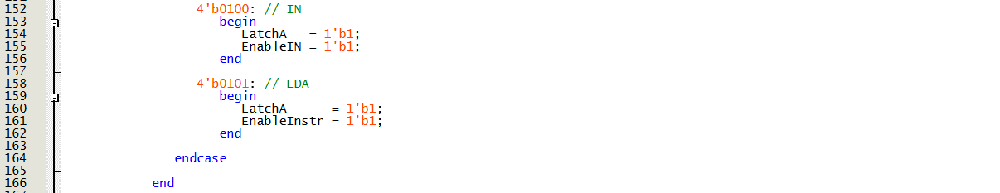
  

</figure>
<figure>
  

    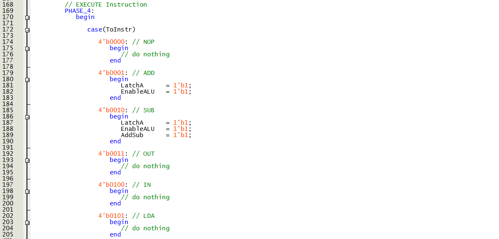
  

</figure>
<figure>
  

    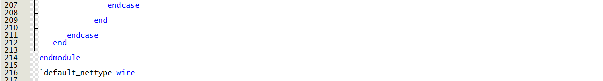
  

</figure>

  <figcaption><em> Figure 25: Code for Controller </em></figcaption>

  

When the code is synthesized, the RTL Viewer can be seen below in Figure 26.

  
<figure>
  

    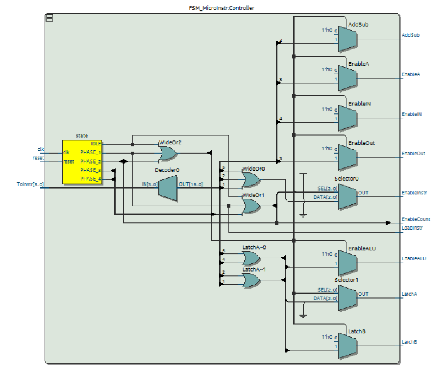
  

</figure>

  <figcaption><em> Figure 26: RTL View for Controller </em></figcaption>

  

The state diagram was then generated and can be seen in Figure 27.

  
<figure>
  

    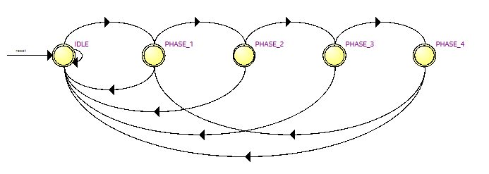
  

</figure>

  <figcaption><em> Figure 27: State Diagram for Controller </em></figcaption>

  

## Final Results

The final results can be seen below. In the video, the button KEY[0] is pressed to simulate a clock and iterate through the instructions.

  
  https://github.com/user-attachments/assets/4b6a0249-e374-493a-8b8a-3150d0f06908
  <figcaption><em>Video 9: Video of Board with Full Very Simple Microprocessor Uploaded </em></figcaption>

